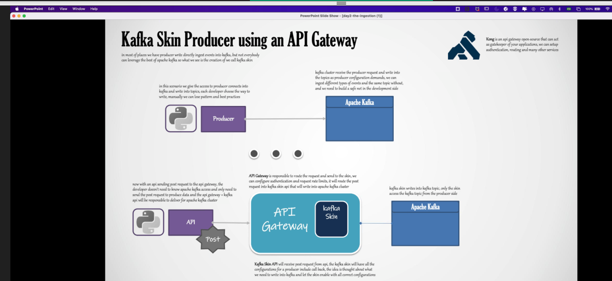

# Day 2 Kafka

Apache Zookeeper:
- Maintaing Config
- Distributed Sync

Broker Skew: When have some fails brokers can be skewed due to leader and followers migration to one broker.

Always prefer odd numbers to brokers due to zookepper quorum approach.

## Topic

Kafka bin to manage topic: list, create, delete, etc..

Replica factor in the topic must be lower or equal than broker quantity.

All brokers work as one, so if you run a command in one broker to create a topic with a replica factor it will distribute to the available brokers.

To change a config for a topic it can be done once at time.

## Data Format

Json is most used in kafka 95% cases.

csv and xml is not recommended for work with kafka not reliable.

AVRO is a binary file type, JSON data model for schema spec, schema evolution, compression (snapy), 

### Confluent Schema Registry [Apache Avro]

## Kafka Producer

librdkafka:
Apache Kafka C/C++ Client Library refactored to write Kafka producer with languages other than Java/Scala.

- Full Exactly Once Semantics (EOS) Support
- High-Level Producer with idempotent & TGransactional Producers
- High Level Balanced Kafka COnsumer
- Simple Consumer
- Admin Client
- Compression
- SSL Support

Confluent's Python Client for Apache Kafka: `confluent-kafka-python`

Kafka Producer first Serialize data, then it is partitioned (from what is passed in header), se sucesso Broker retorna novo metadado (offset) caso failure, retry configuracao no broker automatica, caso a quantidade de retry acknowlegdment ok, caso não tentei 100 vezes e não deu, it becomes Dead Letter Queue.

### Kafka Producer Core COnfiguration

Initial Configs
- Bootstrap servers
- client.id
-key.serializer = serialize key
- value.serializer = name of the class to serialize value of records
Serializers: avro, json, etc...

### Kafka Producer [Message Durability]

3 methods

- fire-and-forget: Producer write and doesn't matter the return (ackknowlegdment back)
- synchronous Send: obrigatoriamente espera o future call e o proceso voltar
- asynchronous Send: as mesnsagens sao commitadas em parallo. e a maioria utiliza

### Acknowledgement

Acks[0]: recommended to High Throughput: IoT, sensors, not reliable data.

Acks[1]: Leader, default Kafka can have data loss, leader returns acks and after it replicate the message, if the leader fail after delivery message the data is lost.

Acks[ALL -1]: ALL, good throughput and message reliability.after leader replicate the data to every follower it returns the message.

**benchmark between acks**

### Kafka Producer [Idempotent Producers & EOS]

Qualquer sistema de mensageria precisa estar em uma semantica

Messaging System Semantics

- At [Most] Once: Se nao tenho retry no Produtor 

- At [Least] Once: Acks [All] nao resolve duplicado pode ser que vc tentou varias vezes escreveu no broker e ele nao retornou.

- [Exactly] Once Semantics [EOS] - it'sd a flag in the producer . `Enable.Idempotence = TRUE` Kafka, Flink Spark Streaming implements this also, but Kafka started it.

Idempotent Producers

Idependente da quantidade de vezes que o produtor rodar com a mesma conf sempre será o mesmo valor.

### Kafka Producer [Message Ordering]

Retries default is > 0.

Retries without message Ordering: `max.in.flight.requestes.per.connection = 1` to ensure that only one request can be sent to broker at a time.

A garantia da ordem é pelo flight requests, pois o retry vai ser apenas na request que está sendo entregue e não haverá varias insercoes assincronas evitando reordering.

No desenho abaixo, o Retries without Message Reordering seria o mundo perfeito: sem duplicadas, na ordem e com garantia de evitar perda de dados.

### Kafka Producer [Batching & Compression]

Configuracoes de Batch: (Kafka vai disparar o que atingir primeiro)
- Batch size: Padrao linha a linha, mas pode ser por tamanho exemplo 1mb
- linger.ms: Quanto tempo para disparar para enviar o dado para o broker. default (0ms)

Compression: (compressao antes de mandar o dado).

Snappy

Se o linger é 0 nãio tem batch, aumentando o linger o batch é ativado.

### Kafka Producer [Sticky Partitioner]

Sticky Partitioning Strategy

Melhorar o tempo de escrita para quem não tem chave, melhora a performance do batching, Round-Robin Partition Strategy (), sticky partitioning

### Callback

Delivery_report callback quando tenho retorno de falha no broker. Precisa implementar no producer, NÃO ESQUECER!

### Schema Registry Needs to be installed and configured in the Cluster.

## Kafka Skin Producer using an API Gateway

In order to avoid producer misconfiguration you can create an API in front of Kafka Cluster, by just using an API Post. Kong API Gatway por exemplo.

## Kafka Connect [Basics]

Varios conectores Source/Sink para várias soluções, porém menor flexibilidade, mas atende praticamente tudo para dba e filesystem.

Woks standalone or distributed. works with rest interface.

### Source

Connector (app) runs tasks on worker inside Kafka COnnect Cluster. it does not resides in the broker but it's a process in between

db connectors: Query-based or Log-based (CDC)

Connector has SMT, simple transformations that can be occur, like change string to integer, maskfield, insertField, ... Use it simple does not transform a lot here.
Converter: you can convert the format at the end like Json converter, avro, protobuff, etc...

Kafka Connect sends schema definition to registry and get schema information from registry.

## JDBC Source Connector

Works for almost all databases, query-based (incremental) we can use a incremental column, if we want timestamp + incrementaing columns (inserting)\

If using schema registry it does schema evolution, but only works for inserting and update, based on increnmental and timestamp

IT"S NOT ALL CONECTORS THAT WORK WITH EXACTLY ONCE SEMANTICS

## Kafka Connect [Debezium DCD Connector] for Event Sourcing

When using avro does not need to conver schema

A connector que get data from n tables, but it's recommend to create one per table to avoid disruption of the system if one connector needs to maintenance or change for some reason.

## Tombstone

QUando você deleta um evento do streaming ele fica um valor NULL, na conf tombstone.on.delete=TRUE delete esses NULL automatico.